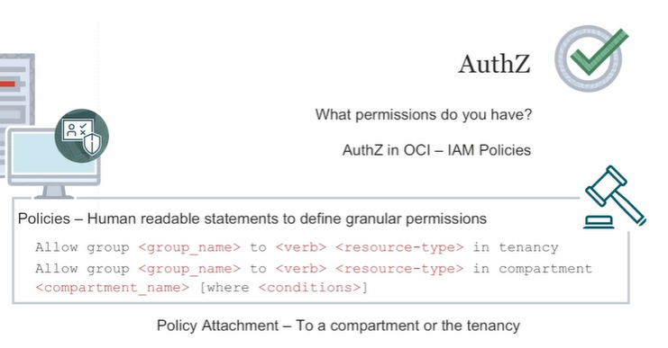

# Teoria de Oracle Cloud Infrastructure

> Teoria e anotações de estudos sobre OCI

## 1. Introdução


OCI é dividida em:

- **Regions**: presença em algum país, presença física no mundo;
- **Availability Domains (AD)**: Data Center discreto. Cada Region tem 1 ou mais ADs;
- **Fault Domain**: Conjunto de Hardware e Infraestrutura dentro de um AD com o objetivo de garantir **Anti-afinidade**. É como se fosse um data center lógico dentro da AD.


Os recursos do OCI podem ser entregues aos clientes das seguintes formas:

1. Public Cloud;
2. Hybrid Cloud;
3. Dedicated Cloud;
4. Multicloud.


---

### 2. Identity and Access Management


O Identity Domain engloba usuários e grupos com AuthN (autenticação com login e password, por exemplo). A AuthZ (autorização) é feita através de Policies, que descrevem o que você pode fazer em recursos da OCI que são armazenados em Compartiments, que são isolamentos lógicos de recursos.

Um recurso no OCI é identificado unicamente pelo **Oracle CLoud ID (OCID)**, como se fosse o ARN da AWS. Os OCIDs são gerados pela Oracle automaticamente e utilizamos principalmente com CLI.

Sintaxe de um OCID:

```json
ocid1.<RESOURCE TYPE>.<REALM>.[REGION][.FUTURE USE].<UNIQUE ID>

ocid1 = parâmetro fixo
RESOURCE TYPE = tipo de recurso (compute instance, block storage)
REALM = conjunto de regiões que compartilham as mesmas características (commercial realm, government realm, ...)
REGION = Código da region
UNIQUE ID = ID único para cada recurso
```


**Observação**: o recurso Tenancy não tem o componente [REGION] por ser um recurso global.

---

#### 2.1. Compartments

Ao criar uma conta na OCI, recebemos um **Tenancy**, que seria o root account da AWS, com um Root Compartment.

Um Compartment seria um conteiner para armazenar recursos do OCI de forma isolada dentro do Tenancy, de modo a controlar acessos aos recursos de cada Compartment de forma isolada.


Cada recurso criado pertence a um único Compartment. Se quiser mudar um recurso de Compartment, você deve migrá-lo de Compartment ou deletá-lo no antigo e criar no novo.

É extremamente importante não criar recursos no root compartment, mas sim em compartmentes específicos.


Recursos de compartimentos diferentes podem interagir entre si.


Os compartments, assim como todos os recursos do IAM, são recursos globais, então você pode ter recursos de várias regiões dentro do mesmo compartment.

Os compartimentos podem ser aninhados em até 6 níveis (Six Levels of Nesting Allowed).

Também é possível definir cotas e budgets para compartments.

> **Note**
>
> É possível utilizar o serviço **Tenancy Explorer** para consultar os recursos que existem dentro de cada compartment.

---

#### 2.2. AuthN e AuthZ

**Principal**: entidade do IAM que tem permissão para interagir com recursos do OCI.

Existem alguns tipos de Principals:

- IAM Users;
- Resource Principals (como instâncias);
- Groups (conjunto de users).

**AuthN**: Além de login e senha, você consegue se autenticar na cloud com API Signing Key (Key Pair) e Auth Tokens, que são strings de token geradas pela Oracle para autenticar APIs de terceiros.

**AuthZ**: É feita na OCI por IAM Policies. As Policies podem ser atachadas a um compartment ou a um tenancy.

Se a policy estiver atachada a um tenancy, ela será aplicada a todos os recursos nesse tenancy.



Por default, todo acesso é negado na OCI, então você escreve apenas `allow policies`.

```json
Allow <group_name> to <verb> <resource-type> in <location> where <conditions>
```

- group_name = grupo de usuários, não há como definir políticas para usuários individuais;
- verb = há 4 níveis de verbos:

    - Manage = full access (admin)
    - Use = leitura + ações variadas dependendo do tipo de recurso (resources e end users)
    - Read = inspect + metadata (auditores internos)
    - Inspect = listar recursos (auditores terceiros)

- resource-type = pode ser:

    - all-resources
    - database-family
    - instance-family
    - object-family

> **Obs**.: além de operar no nível de família dos recursos, você consegue fazer gestão granular sobre os recursos, por exemplo, permitindo que alguém acesse as instâncias mas não acesse as imagens.

- loccation = tenancy, compartment

Ao criar um usuário no OCI, você precisa informar seu e-mail, pois esse usuário receberá um e-mail para ativar sua conta e resetar seu password.

